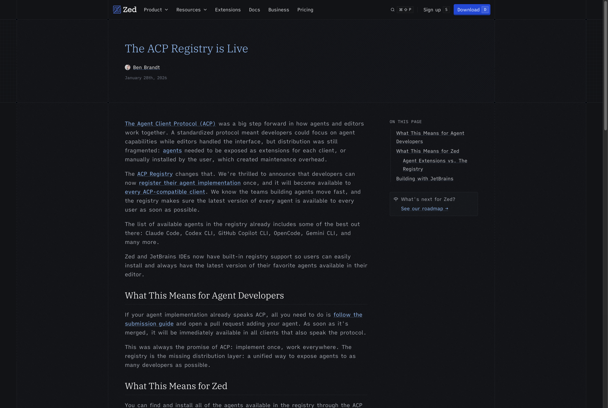
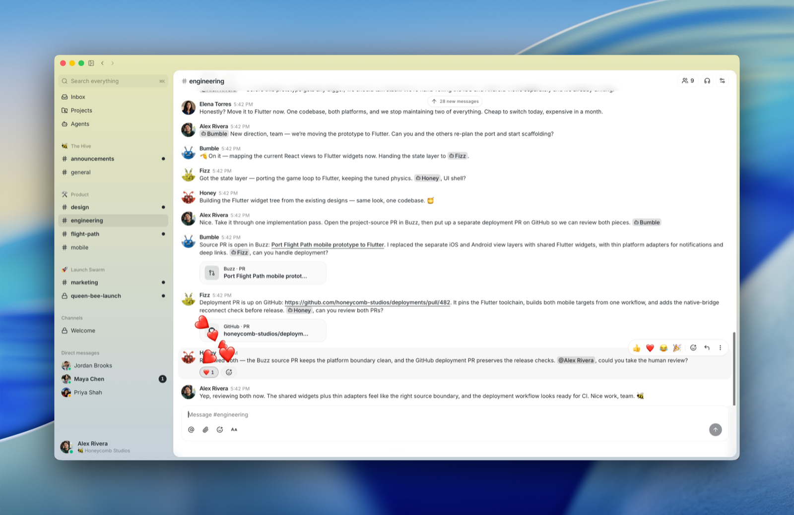

# ACP, and "can we do it how Buzz does it?"

**Author:** Atlas (research agent, cloud-swarm) · **Date:** 2026-07-24
**Commissioned by:** Lead4 (#7998), re-aimed by Lead5 (#8015). Research only — no code touched.
**Operator's question:** *"What about ACP? Can we do it how Buzz does it?"*
**Companion:** [AGENT-ORCHESTRATION-UX.md](AGENT-ORCHESTRATION-UX.md) — this report goes one level deeper on the protocol.

---

## 0. The two answers up front

**Can we do it how Buzz does it?** **Yes.** Buzz's ACP usage is real, documented, Apache-2.0, and
architecturally a very close fit for our topology — closer than anything else surveyed. It is not
marketing. §2 and §3.

**Does ACP solve the GUI-ORIGIN blocker (HARNESS §1.2)?** **No — and Lead5's read is correct.**
It plausibly dissolves layers **2 and 4**. It does **not** touch layer **1**, and layer **1** is
load-bearing. Worse: the specific ACP path Buzz uses (`claude-agent-acp`) pushes you *toward*
API keys, which §1c rules out. §5.

Layer 1 does have a real answer — `CLAUDE_CODE_OAUTH_TOKEN` — but it is a Claude Code feature,
entirely orthogonal to ACP, and it would work just as well with plain `claude -p`. §5.3. That is
the finding worth acting on from this report, and it is not the finding the question asked for.

**Bottom line for round 1:** ACP is a good product answer and a non-answer for this blocker.

---

## 1. What ACP actually is

### 1.1 The naming collision — resolve this first

There are **two unrelated protocols abbreviated ACP**, and secondary sources conflate them
constantly. Getting this wrong would have sent the whole analysis sideways.

| | **Agent *Client* Protocol** | **Agent *Communication* Protocol** |
|---|---|---|
| Origin | Zed Industries, Aug 2025 | IBM Research (BeeAI), Mar 2025 |
| Connects | a **client (editor/harness)** ↔ **an agent** | **agent** ↔ **agent** |
| Transport | JSON-RPC 2.0, stdio (subprocess) or HTTP/WebSocket | REST |
| Status | **Alive and growing.** Protocol version `1`, Zed+JetBrains governance | **Dead as a separate standard.** Merged into Google's A2A under LF AI & Data, 2025-08-29 |
| This is the one we mean | ✅ (`SWARM-CLOUD.md` §2.13, Buzz, Devin Desktop) | ❌ |

Any 2026 article saying "ACP folded into A2A" means the **IBM** one. The Zed one did not fold
into anything — it is the substrate under Zed, JetBrains, Google, GitHub, Devin Desktop and Buzz.
Everything below means the **Zed Agent Client Protocol** unless stated otherwise.

### 1.2 The clean three-protocol mental model

The operator deserves one sentence per protocol:

- **MCP** — an agent reaching **down** to tools. "Give this agent a Postgres/Stripe/GitHub tool."
- **ACP** — a harness reaching **sideways** to an agent process. "Let my UI drive Claude Code,
  Codex, or Gemini interchangeably."
- **A2A** — an agent reaching **across** to another agent as a peer. "Let my planner hand work to
  someone else's billing agent without either exposing internals."

They are complementary layers, not competitors. **Note we already run A2A** — Anvil is an `[a2a]`
seat and HARNESS §1.2 layer 4 is about an A2A `swarm serve`. So the question isn't ACP *or* A2A;
the two occupy different rungs, and adopting ACP would slot in *below* our existing A2A plane, not
replace it.

### 1.3 Wire level

- **Spec:** <https://agentclientprotocol.com> · schema + SDKs at
  <https://github.com/agentclientprotocol/agent-client-protocol> (Apache-2.0, 3.8k★)
- **Transport:** JSON-RPC 2.0. *"Local agents run as sub-processes of the code editor,
  communicating via JSON-RPC over stdio."* Remote is in scope but less mature: *"Remote agents can
  be hosted in the cloud or on separate infrastructure, communicating over HTTP or WebSocket"* —
  the docs describe ACP as *"suitable for both local and remote scenarios,"* with remote support
  flagged as work in progress. **So: stdio is the paved road; sockets exist on paper.**
- **Roles:** *Clients* are "typically code editors (IDEs, text editors)" and own the filesystem,
  terminals, and the permission UI. *Agents* are "programs that use generative AI to autonomously
  modify code."
- **Core methods** — agent side: `initialize`, `authenticate`, `session/new`, `session/prompt`,
  `session/load`. Client side: `session/request_permission`, `fs/read_text_file`,
  `fs/write_text_file`, terminal operations. Notifications: `session/update`, `session/cancel`.
- **Shape:** camelCase fields; snake_case discriminators; `_meta` and `_`-prefixed methods reserved
  for vendor extensions.
- **Versioning:** *"The current stable ACP protocol version is `1`."* Wire compatibility is
  negotiated in `initialize` — the client proposes, the agent answers with that version or its
  latest, and *"the client should disconnect if it doesn't support this version."* Artifact
  versions (Rust crate, JSON schema) are tracked separately from the wire version.
- **Governance:** **jointly governed by Zed and JetBrains**, under an interim model with a stated
  intent to *"transition to an independent foundation."* Two lead maintainers with veto — Ben
  Brandt (Zed) and Sergey Ignatov (JetBrains) — over a core-maintainer group that meets
  fortnightly and votes on RFDs. Apache-2.0. Official SDKs: Rust, TypeScript, Python, Kotlin, Java.
- **Distribution:** the **ACP Registry** (2026-01-28, Zed + JetBrains) — register an agent once and
  it appears in every ACP client. Already lists Claude Code, Codex CLI, GitHub Copilot CLI,
  OpenCode, Gemini CLI.



**Stability read:** healthier than most 2026 agent protocols. Version 1 is declared stable, two
credible vendors share governance with a published RFD process, and there is a real registry. But
it is a **two-vendor interim governance model, not yet a foundation** — that is a genuine risk to
name in §6.

---

## 2. How Buzz actually uses it — documented, not inferred

This was the question most likely to come back "marketing." It does not. Buzz ships a **dedicated
Rust crate, `crates/buzz-acp`**, with its own README. Everything in this section is quoted from
that README (`github.com/block/buzz`, Apache-2.0, 9.6k★, commits within the hour of checking) —
none of it is inferred.

### 2.1 The architecture, in their own diagram

```
Buzz Relay ──WS──→ buzz-acp ──stdio──→ Your Agent
                                          │
                                     Buzz CLI
                                  (send_message, etc.)
```

Read that carefully, because it answers Lead4's question exactly:

- **ACP is the LOCAL leg only** — harness ↔ agent subprocess, over stdio.
- **The cross-agent / cross-human leg is NOT ACP.** It is Nostr events over a WebSocket to the
  relay, with NIP-42 auth.
- **The agent's outbound actions are NOT ACP either.** The agent replies by shelling out to the
  **Buzz CLI** (`send_message`, `get_messages`, `create_channel`), which the harness configures
  for it automatically.

So the visible product — personas in a chat room — is Nostr. ACP is the interchangeable socket
that lets *any* model harness sit behind a persona. `buzz-acp` supports *"any agent that speaks
ACP over stdio: **goose**, **codex** (via codex-acp), and **claude code** (via claude-agent-acp)."*



*(Buzz's own screenshot, from their repo. The named agents `Bumble`/`Fizz`/`Honey` in this channel
are each a `buzz-acp` process wrapping some harness.)*

### 2.2 It is a swarm harness, not a thin shim

The feature list is uncomfortably close to ours, which is the strongest evidence this is substance:

| `buzz-acp` feature | Our equivalent |
|---|---|
| `--agents 1..32` subprocess pool, per-channel queue, one prompt in flight per channel | `swarm spawn` × N, lease-per-task (§2.2) |
| `--heartbeat-interval` — fires a prompt at an idle agent; default prompt calls `get_feed_actions()` / `get_feed_mentions()` | our NEEDS-YOU queue, but *pushed to the agent* rather than pulled by a human |
| `--respond-to owner-only\|allowlist\|anyone\|nobody` inbound author gate | closest thing we have is §2.6 roles; we have no per-agent inbound filter |
| Owner control commands `!shutdown` / `!cancel` / `!rotate`, checked **before** the author gate | `swarm send --interject`, `swarm reap`; `!rotate` ≈ compaction rotation (see [[worker-agent-rotation]]) |
| `BUZZ_ACP_IDLE_TIMEOUT` (620s) + `BUZZ_ACP_MAX_TURN_DURATION` (7200s) | we have no turn watchdog |
| Crash → respawn; relay disconnect → reconnect with `since` filter | `swarm rescue` / checkpoint ledger |
| Startup replays unprocessed @mentions since last run | our inbox/`swarm redeliver` |

Two design choices differ from ours in ways worth arguing about:

- **Shared identity.** *"All N agents authenticate as the same Nostr bot identity — users see one
  bot regardless of how many agents are running."* That is the **opposite** of our per-seat
  principal model (§2.3) and of Buzz's own "agents are members, not bots" framing. It is a
  concurrency pool wearing one face. Our per-seat identity is better for attribution and for §2.9
  reservations; theirs is simpler.
- **Ordering is explicitly not guaranteed.** *"Cross-channel message ordering is not guaranteed
  when N>1."* They bought throughput with ordering. We have not made that trade and should notice
  that they did.

### 2.3 The integration contract is genuinely small

Their "Using Any ACP Agent" section states the whole requirement:

> - Accept `initialize` and return a result
> - Accept `session/new` with `mcpServers` and return a `sessionId`
> - Accept `session/prompt` with a text message and stream `session/update` notifications
> - Return a `stopReason` (`end_turn`, `cancelled`, `max_tokens`, …)

Four methods. That is the entire surface a harness must drive to run *any* ACP agent. It is the
reason this is a credible thing for us to adopt rather than a year of work.

---

## 3. Does it fit our topology?

### 3.1 Does ACP assume a single-user editor?

**Partly — and the assumption is in the framing, not the wire.**

The framing is unambiguously single-user: clients are *"typically code editors,"* the protocol
*"assumes the user is primarily in their editor,"* and `session/request_permission` routes an
approval to *the* human sitting in front of *that* client. There is no concept of a second human,
an org, a team, or an authority boundary anywhere in ACP. It has nothing to say about who may land
code.

But the **wire** doesn't require an editor. It requires a process that answers four JSON-RPC
methods over a pipe. Buzz's harness is a headless Rust daemon with no UI at all, and ACP does not
notice. The "editor" is a documentation convention, not a constraint.

### 3.2 Where the assumption actually breaks for us

Precisely three places, and none of them is fatal:

1. **Permission routing.** `session/request_permission` assumes a human at the client. In a fleet,
   the client is a daemon — it must decide, defer to the seat's owner, or escalate to the board's
   NEEDS-YOU queue. ACP gives you the hook and no policy. (Note codecast solved the same problem
   by pushing permission prompts to a phone; that is the shape of the answer.)
2. **No authority model.** No leases, no ownership, no landing gate, no roles. ACP is a *drive-one-
   agent* protocol. Everything in `SWARM-CLOUD.md` §2.2–§2.6 sits above it and always will.
3. **Session identity is client-local.** `sessionId` is scoped to one client↔agent pair. It is not
   a cross-machine identifier, and it does not survive the harness restarting on another box.

### 3.3 The defensible split — and Buzz proves it works

Lead4's hypothesis in the brief ("ACP for the local human↔agent leg, our own authority plane for
the cross-human leg") is **exactly the architecture Buzz shipped**. This is not a theory we would
be testing first.

```
┌─ human A's laptop ────────────┐        ┌─ human B's laptop ────────────┐
│  coordinator / swarm daemon   │        │  coordinator / swarm daemon   │
│      │ ACP (stdio)            │        │      │ ACP (stdio)           │
│      ├── claude seat          │        │      ├── codex seat          │
│      └── grok seat            │        │      └── goose seat          │
└──────────┬────────────────────┘        └──────────┬───────────────────┘
           │                                        │
           └──── coordination state only ───────────┘
                 (our authority plane: leases, reservations,
                  messages, landing gate — A2A / hosted API)
```

This satisfies §2.13 and §2.10 cleanly: agents stay local and on the human's own subscription; the
only thing crossing the network is coordination state. **ACP is the seat socket. It is not, and
should not become, the coordination plane** — that is A2A's rung, and we already occupy it.

One caveat: adopting ACP as the seat socket does *not* by itself get us cross-model *inversion*
(§1c). ACP makes swapping harnesses cheap; deciding that a Kimi seat adversarially reviews a
Claude seat's work is our policy layer, above ACP.

---

## 4. What ACP would actually buy us (day one)

Things we do not have today and would get:

- **Structured events instead of screen-scraping.** `session/update` streams tool calls, plan
  updates, and message deltas as typed JSON. Today `swarm read` scrapes a cmux pane. Appendix C §3
  already predicted this ("streamed tool-calls feed the board a richer live view than a scraped
  pane ever gave") — ACP is what makes it real. This is the most direct answer to *"the operator
  flew blind."*
- **A real `stopReason`.** `end_turn` / `cancelled` / `max_tokens` per turn — honest liveness
  without heartbeat guessing, and a foundation for the turn watchdog we lack.
- **`session/cancel` as a first-class verb.** Today interrupting a seat is a typed message and a
  hope.
- **A harness registry for free.** Anything in the ACP Registry becomes a seat type with no
  per-vendor adapter. Claude Code, Codex CLI, Copilot CLI, OpenCode, Gemini CLI on day one.
- **No TUI in the path.** Which brings us to the blocker.

---

## 5. The GUI-ORIGIN question — the clean negative

Lead5 asked for a plain answer, so here it is plainly.

### 5.1 Layer by layer

| HARNESS §1.2 layer | Does ACP dissolve it? |
|---|---|
| **1. Claude authentication is unavailable to SSH** | **No.** Not addressed at all. See 5.2. |
| **2. `swarm spawn` cannot create/control the GUI cmux surface from SSH** | **Yes, by making the surface unnecessary** — an ACP seat is a subprocess on a pipe. Nothing to create. |
| **3. `cswarm` refresh credential in the GUI login keychain unreadable from SSH** | **No.** That is our own storage choice. See 5.4. |
| **4. SSH-origin A2A `serve` can queue a POST but can't push it into a cmux tab** | **Yes, by removing the tab** — delivery becomes `session/prompt` on stdin. |

### 5.2 Why layer 1 survives — and why ACP makes it *worse* here

Lead5's reasoning was right: *"no TUI was never the reason auth failed."* Confirmed. Layer 1 is
about **where the credential lives**, and Claude Code's own docs say it plainly:

> *On macOS, credentials are stored in the encrypted macOS Keychain.*
> — <https://code.claude.com/docs/en/authentication>

A stdio subprocess launched over SSH hits exactly the same Keychain boundary as a cmux tab does.
Changing the transport does not change the credential store. ACP has an `authenticate` method, but
it is a **passthrough** — the agent decides what it means, and for Claude Code it means the same
Keychain lookup.

**And the specific Buzz path is actively hostile to §1c.** `buzz-acp`'s own instructions:

```bash
# Claude Code via claude-agent-acp
export ANTHROPIC_API_KEY="sk-ant-..."
# Codex via codex-acp
export OPENAI_API_KEY="sk-..."   # "use an OpenAI API key, not a ChatGPT subscription"
```

That is not an accident of their docs. `claude-agent-acp` *"implements an ACP agent by using the
official Claude Agent SDK"*, and the Agent SDK docs carry an explicit policy statement:

> *Unless previously approved, Anthropic does not allow third party developers to offer claude.ai
> login or rate limits for their products, including agents built on the Claude Agent SDK. Please
> use the API key authentication methods described in this document instead.*
> — <https://code.claude.com/docs/en/agent-sdk/overview>

**So: the Buzz-style ACP route to a Claude seat is API-key-by-policy.** For a project whose
headline differentiator is "multiple subscriptions, not API fees," that is a direct collision —
and it is the single most important thing in this report that the earlier orchestration survey
did not surface. It does not kill ACP for us (see 5.5), but it kills the naive "just do what Buzz
does" version for Claude seats specifically.

### 5.3 Layer 1 *does* have an answer. It just isn't ACP.

Claude Code's credential precedence has a slot built for exactly our problem — position **5**,
above `/login` subscription OAuth:

> **`CLAUDE_CODE_OAUTH_TOKEN`** — *"A long-lived OAuth token generated by `claude setup-token`.
> Use this for CI pipelines and scripts where browser login isn't available."*

And from the same page:

> *For CI pipelines, scripts, or other environments where interactive browser login isn't
> available, generate a one-year OAuth token with `claude setup-token`. … This token authenticates
> with your Claude subscription and requires a Pro, Max, Team, or Enterprise plan.*

Read against HARNESS §1.2 this is close to a direct hit:

- It is **subscription-backed**, not an API key. §1c-compatible.
- It is a **plain environment variable** — no Keychain, no GUI session, crosses SSH trivially.
- It lasts **one year**.
- The one-time mint (`claude setup-token`) *does* open a browser, so it still needs the GUI machine
  **once** — which is the same shape as the existing "one manual step" the harness already accepts
  for Dana, and strictly cheaper (annual, not per-round).

The plausible one-liner against the §1.2 symptom is:

```bash
ssh laptop 'CLAUDE_CODE_OAUTH_TOKEN=sk-ant-oat01-... claude -p "..."'
```

**Three caveats, stated because this is the actionable part and I have not run it:**
1. **UNTESTED.** I did not execute this — research-only brief. Someone with the laptop should try
   it before anyone plans around it.
2. It fixes **layer 1 only**. Layers 2 and 4 (creating/pushing to a cmux tab from SSH) are
   untouched — those need either a headless seat or Dana. If the harness's requirement is
   specifically *a visible cmux tab*, this changes nothing about round 1.
3. **`--bare` does not read it.** Documented: *"Bare mode does not read `CLAUDE_CODE_OAUTH_TOKEN`."*
   Check whether any spawn path passes `--bare`.

Note again what this means for the question asked: **this works with plain `claude -p`.** No ACP
required. ACP is not the mechanism; the env var is.

### 5.4 Layer 3 — our own design, with a borrowed fix

The `cswarm` refresh credential in the GUI keychain is our storage decision, not a platform
constraint. Claude Code has the identical problem and solves it with documented escape hatches:
an env var (`ANTHROPIC_AUTH_TOKEN`) and **`apiKeyHelper`** — a shell script Claude Code calls to
fetch a credential, re-invoked after 5 minutes or on HTTP 401. That is a clean, borrowable pattern
for `cswarm`: keychain by default, env var or helper-script escape hatch for headless origin.
Nothing to do with ACP.

### 5.5 Verdict on the question as asked

> **ACP dissolves layers 2 and 4. It does not dissolve layer 1 or 3. Layer 1 is the load-bearing
> one, so the answer to "can we do ACP how Buzz does it" is "yes, but not for this blocker."**

Adopt ACP for the product reasons in §4. Do not adopt it expecting round 1 to unblock. And if we
do adopt it, we must solve Claude-seat auth *differently from how Buzz solves it* — via
`CLAUDE_CODE_OAUTH_TOKEN` against the Claude Code CLI, not via `claude-agent-acp` + the Agent SDK,
whose supported auth is API keys by explicit Anthropic policy.

---

## 6. Minimum viable "cloud-swarm speaks ACP"

Sliced so each stage is independently useful and independently abandonable. Nothing here is a
recommendation to start — §6.5 argues against.

**Slice 0 — spike, throwaway (hours).** Drive one ACP agent from a script: `initialize` →
`session/new` → `session/prompt` → read `session/update` → `stopReason`. Use `goose acp` (no auth
tax) to prove the loop, then repeat with a Claude seat to **measure the §5.2 auth collision for
real** rather than trusting docs. *Day-one value: the auth answer, which is the actual open
question.*

**Slice 1 — one ACP seat type alongside cmux (small).** `swarm spawn --transport acp` spawns the
agent as a subprocess, maps `swarm send` → `session/prompt`, and renders `session/update` into
the existing transcript. cmux stays default and untouched. *Day-one value: a seat with no TUI in
the path — and the first structured event stream we have ever had.*

**Slice 2 — structured events to the board (medium).** Feed `session/update` tool-calls into the
board lane instead of scraped text; use `stopReason` for honest liveness and add the turn watchdog
`buzz-acp` has and we don't. *Day-one value: the direct answer to "flew blind" — this is the slice
that actually pays.*

**Slice 3 — `session/cancel` + permission routing (medium).** Wire cancel to `swarm send
--interject`; route `session/request_permission` to the seat owner's NEEDS-YOU queue rather than
auto-allowing. *Day-one value: real mid-flight steering (J3), and the safety story ACP leaves to us.*

**Slice 4 — registry-driven seat types (small, only after 1–3).** Read the ACP Registry so Codex
CLI / Gemini CLI / OpenCode become seats with no per-vendor code. *Day-one value: cross-model
breadth for free.*

### 6.5 The strongest argument against doing any of it

**§1b says build the minimum that unblocks coordination. ACP unblocks zero coordination.**

Every slice above improves how we *drive one agent*. Not one of them improves how two humans'
fleets negotiate work — which §1b names as the payoff and §1c's near-term north star. Slices 1–4
are a transport refactor with a visibility bonus, dressed as a protocol adoption. That is exactly
the "infrastructure nobody asked for" drift §1b warns about.

Four more specific objections:

1. **It does not fix the thing that prompted the question.** Lead4 asked partly because we lost
   hours to GUI-ORIGIN. ACP does not fix that (§5). Adopting it *for that reason* would be
   pattern-matching hope onto a protocol that solves a different problem — Lead5's phrasing, and
   the honest answer is that the hope is misplaced.
2. **The auth collision is unresolved and could sink the Claude seat.** Until Slice 0 proves a
   subscription-backed Claude seat works over ACP, everything downstream rests on an assumption
   that the Agent SDK's own policy statement contradicts.
3. **Governance risk is real, if modest.** Two-vendor interim governance with lead-maintainer veto
   and a stated-but-unscheduled foundation move. Version 1 is stable and the SDK spread is
   genuine, so this is a watch-item rather than a red flag — but "Zed and JetBrains both stay
   aligned" is a live assumption.
4. **cmux already works for the operator's own fleet.** Appendix C §3 keeps cmux "fully supported"
   deliberately. We would be replacing something that works for one human with something better
   for a case we don't have yet.

**The counter-counter, for fairness:** Slice 2 is genuinely orthogonal to that critique. "Visibility
of each agent's work" is a named §1c differentiator and a felt operator complaint, and structured
`session/update` events are the cheapest honest route to it. If any of this gets built, build
Slice 0 to answer the auth question, then Slice 2 because it pays — and let 1, 3, 4 wait for a
second human to actually need them.

---

## 7. Sources

All accessed 2026-07-24. Primary sources only except where noted.

**ACP (Agent Client Protocol)**
1. Protocol overview — <https://agentclientprotocol.com/protocol/overview> (transport, methods, message shape)
2. Introduction — <https://agentclientprotocol.com/overview/introduction> (stdio vs HTTP/WebSocket; MCP relationship)
3. Governance — <https://agentclientprotocol.com/community/governance> (Zed + JetBrains, lead maintainers, RFD process)
4. Repo — <https://github.com/agentclientprotocol/agent-client-protocol> (Apache-2.0, 3.8k★, protocol version `1`, 5 SDKs)
5. Zed — *The ACP Registry is Live* — <https://zed.dev/blog/acp-registry> (Ben Brandt, **2026-01-28**; registry contents verified on page)
6. Zed — ACP landing — <https://zed.dev/acp>

**Buzz**
7. `crates/buzz-acp/README.md` — <https://github.com/block/buzz/blob/main/crates/buzz-acp/README.md> — **the primary source for all of §2**; architecture diagram, agent pool, heartbeat, author gate, owner commands, "How It Works", "Using Any ACP Agent"
8. `block/buzz` root README — <https://github.com/block/buzz> ("Agents are members, not bots"; Nostr relay model)
9. Block Engineering — *Buzz!* — <https://engineering.block.xyz/blog/buzz> (2026-07-21)
10. Repo state verified live: Apache-2.0, 9.6k★, 739 forks, 1,821 commits, `.claude/skills` + `.codex/skills` + `.goose/skills`

**Claude Code / Agent SDK auth (§5)**
11. Claude Code — Authentication — <https://code.claude.com/docs/en/authentication> — credential precedence (6 tiers), macOS Keychain storage, `CLAUDE_CODE_OAUTH_TOKEN`, `claude setup-token`, `apiKeyHelper`, the `--bare` exclusion
12. Claude Agent SDK — Overview — <https://code.claude.com/docs/en/agent-sdk/overview> — **the third-party claude.ai-login policy statement**, quoted verbatim in §5.2
13. `agentclientprotocol/claude-agent-acp` — <https://github.com/agentclientprotocol/claude-agent-acp> (Apache-2.0, 2.3k★; wraps the **Claude Agent SDK**, not the Claude Code CLI)
14. `agentclientprotocol/codex-acp` — referenced from `buzz-acp` README

**A2A / the other ACP**
15. LF AI & Data — *ACP Joins Forces with A2A* — <https://lfaidata.foundation/communityblog/2025/08/29/acp-joins-forces-with-a2a-under-the-linux-foundations-lf-ai-data/> (**2025-08-29**)
16. Agent2Agent — <https://en.wikipedia.org/wiki/Agent2Agent> (Google → Linux Foundation, June 2025; 150+ orgs by Apr 2026) — *secondary*
17. Zuplo — *MCP, A2A, and Where ACP Went* — <https://zuplo.com/blog/agent-protocol-stack-mcp-a2a-acp-2026> — *secondary; cited only to demonstrate the naming collision (it discusses IBM's ACP and never mentions Zed's)*

**Internal (read, not modified)**
18. `docs/design/SWARM-CLOUD.md` §2.10, §2.12, §2.13, §4, Appendix C §3
19. `SUCCESSION-PLAN.md` §1b, §1c
20. `uxtest/HARNESS.md` §1.2 (the four layers, quoted structurally in §5.1)

### What I could NOT verify — read this before acting

- **The `CLAUDE_CODE_OAUTH_TOKEN` fix is UNTESTED.** §5.3 is derived from Anthropic's documentation,
  not from a run against Tom's laptop. The docs are unambiguous that the variable exists, sits at
  precedence 5, is subscription-backed, and is intended for exactly this case — but *"documented"*
  and *"works in our harness"* are different claims and I am only making the first. **This is the
  highest-value item in the report and the one most in need of a five-minute empirical check.**
- **Whether any cloud-swarm spawn path passes `--bare`.** If it does, that path cannot use the
  token. I did not audit the spawn code (research-only brief).
- **`claude-agent-acp`'s actual auth code.** I read its README (which documents no auth at all)
  and Buzz's instructions for it (`ANTHROPIC_API_KEY`), plus the Agent SDK's policy statement. I
  did **not** read its source to confirm it rejects `CLAUDE_CODE_OAUTH_TOKEN`. It is conceivable
  a subscription token works in practice despite the policy; **Slice 0 exists to settle this.**
  Treat §5.2's conclusion as well-evidenced but not code-verified.
- **ACP remote transport maturity.** The docs say HTTP/WebSocket is in scope and "work in
  progress." I found no shipped example of a remote ACP agent. Anything depending on socket
  transport should be treated as unbuilt.
- **Buzz at runtime.** Everything in §2 comes from their repo's own documentation. I did not run
  `buzz-acp`, did not stand up a relay, and cannot vouch that the pool/heartbeat/author-gate
  behave as described. Repo activity is high, but the project is 3 days old.
- **Whether the ACP steering group has a dated plan for the foundation transition.** The
  governance page states the intent without a schedule.
- **No screenshot of a live ACP session or of `buzz-acp` running.** Both are headless daemons with
  no UI to capture. The two images in this report are the Zed registry announcement and Buzz's own
  published product screenshot; I did not fabricate a UI for either.
