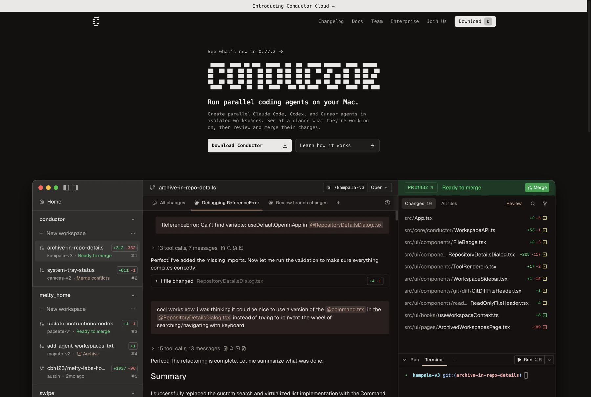
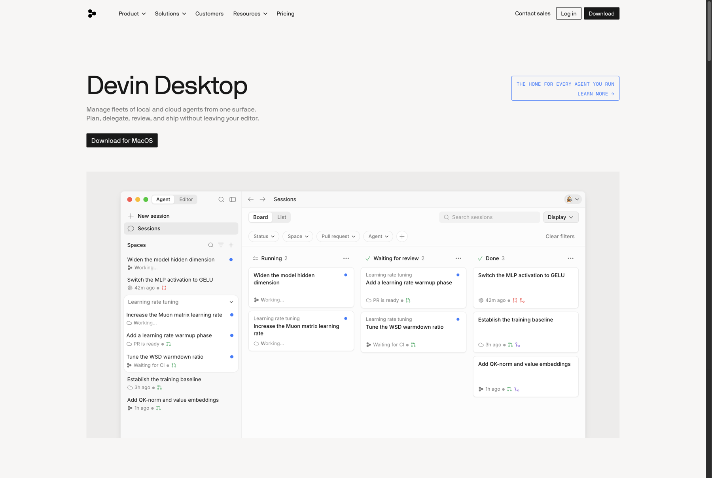
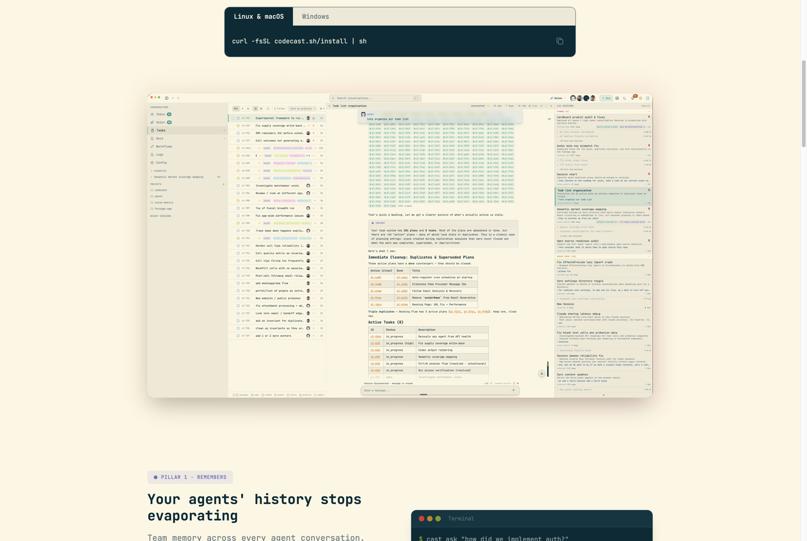
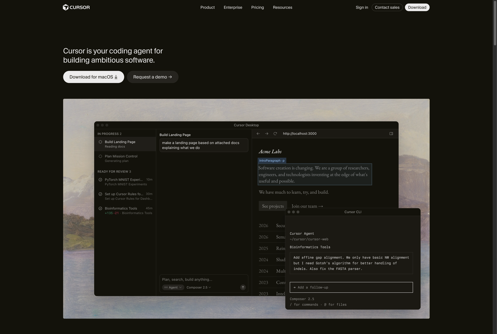
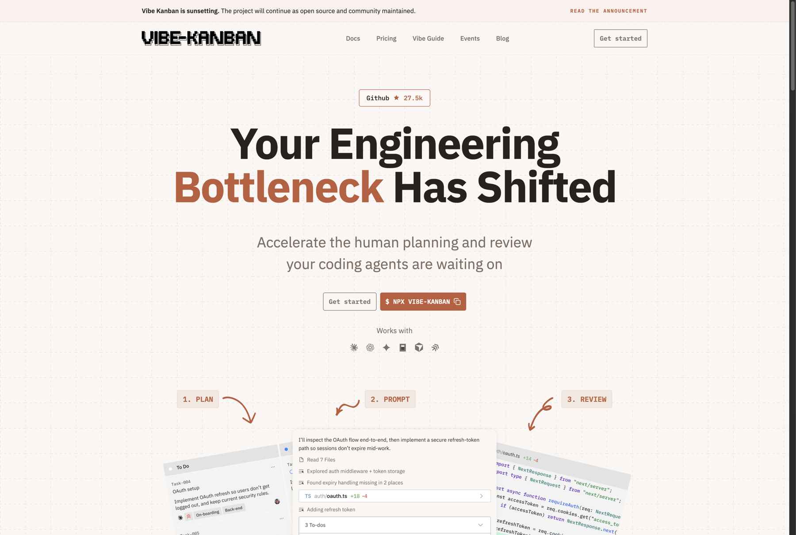
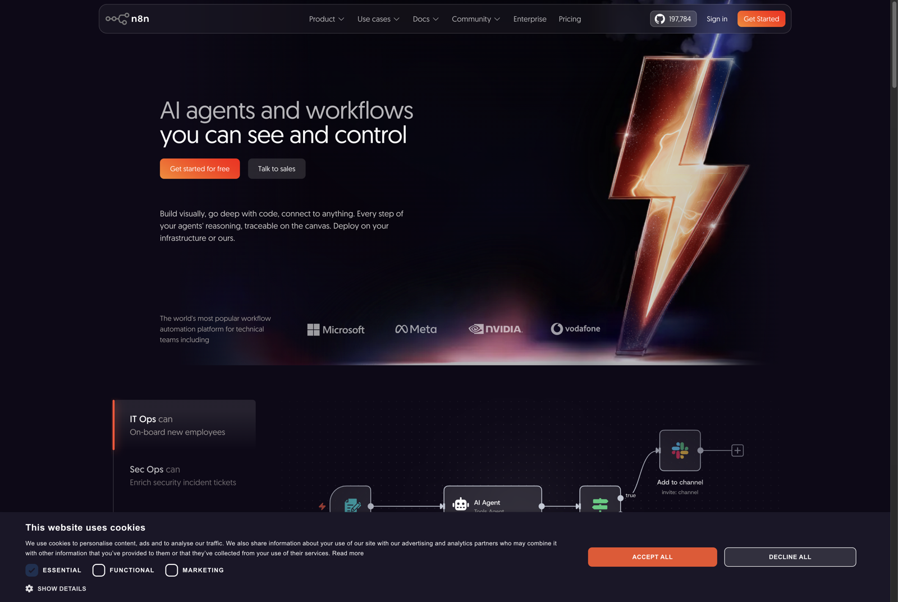
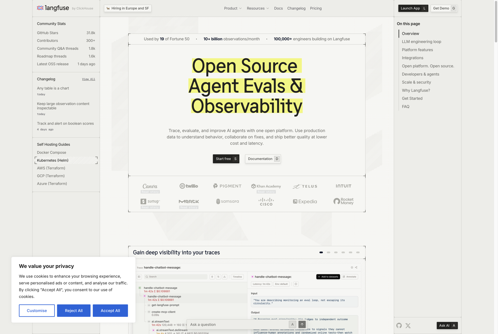

# UI/UX for managing headless agent swarms at scale — landscape research

**Author:** Atlas (research agent, cloud-swarm) · **Date:** 2026-07-24
**Commission:** Lead4, on behalf of the operator. Research only — no code, no recommendations acted on.
**Question:** we orchestrate agents through cmux terminal tabs and don't think that's the future. If we ran agents headless, what interaction models exist, and which are actually good?

Evaluated against the six cloud-swarm constraints recorded in `SUCCESSION-PLAN.md` §1c and
`docs/design/SWARM-CLOUD.md` §2.10 / §4 / Appendix C §3:

| # | Constraint | Short name |
|---|---|---|
| C1 | Each human brings their **own** agents and subscriptions — not one shared API budget | BYO-subs |
| C2 | Agents run on the **human's own machine**; only coordination state crosses the network | Local-exec |
| C3 | **Visibility** of each agent's work (the operator "flew blind") | Visibility |
| C4 | **Full-swarm on-the-fly steering** while a human is watching | Live-steer |
| C5 | **Multi-human** collaboration with org structure / comms routing | Multi-human |
| C6 | **Cross-model by design** (model inversion + fusion) | Cross-model |

---

## 1. Executive summary

1. **Terminal tabs are not wrong — they're *unscalable along the wrong axis*.** They fail at multi-human and multi-machine (C5/C2-at-scale) long before they fail at agent count. Every serious product has converged on the same replacement: a **status-sorted list/board of agent sessions on the left, the agent's live transcript in the middle, its diff/PR on the right.** Conductor, Cursor Desktop, Devin Desktop and codecast all independently landed on this exact three-pane shape.
2. **Four paradigms actually matter for us.** (a) **Board/kanban + drill-in chat** — the dominant convergent answer for one human, many agents. (b) **Chat-room with agent personas** (Buzz, Claude Tag) — the only paradigm that natively models *multi-human + org routing*, which is C5. (c) **Session-record / triage-inbox overlay** (codecast, ai-maestro) — a paradigm Lead4's brief didn't name, and the one that fits C1+C2 best because it *watches* the agents you already run rather than hosting them. (d) **Observability-first** — at scale, watching beats driving, and nobody in the coding-agent space has actually built it properly yet.
3. **Most hosted consoles are structurally incompatible with C1 and C2**, and this is not a soft preference — Devin Cloud, Jules, Codex cloud, Claude Code on web, Conductor Cloud and GitHub Agent HQ all execute in *their* VMs on *their* billing relationship. Agent HQ ships partner agents "as part of paid Copilot subscriptions" — the opposite of BYO-subs.
4. **The interoperability question is already settled and we picked right.** ACP (Agent Client Protocol) is now the substrate under Zed, JetBrains, Devin Desktop and Buzz, with a joint agent registry. `SWARM-CLOUD.md` §2.13 already makes ACP the default transport. That is the single most load-bearing correct bet in the spec.
5. **Visual graph/DAG builders (n8n, LangGraph Studio, CrewAI Studio) are the wrong genre for us** — they compose *workflows before they run*, and our problem is steering *live, autonomous, long-running* agents.
6. **Honest counter-signal:** vibe-kanban — the flagship kanban-for-agents, 27.5k stars — is **sunsetting**, and codecast already ships ~80% of our differentiator, MIT-licensed and free. Read §5 before treating "build a board" as obvious.

---

## 2. Landscape map by paradigm

| Paradigm | Representative products | One-line shape |
|---|---|---|
| **Terminal multiplexer / session manager** | cmux, claude-squad, agent-deck, dmux, amux, herdr, thurbox, repomon, tmux-ide | Agents are panes/tabs; you drive by typing into one |
| **Desktop orchestrator (worktree-per-agent)** | Conductor, Crystal → Nimbalyst, Emdash, mux, clave, aizen, octomux, supacode, Orca | Sidebar of workspaces with status badges; drill into transcript + diff |
| **Board / kanban + drill-in chat** | Devin Desktop (Agent Command Center), vibe-kanban, GitHub mission control, Cursor Desktop, openkanban | Cards by status (Running / Needs review / Done); click a card, chat with its agent |
| **Chat-room with agent personas** | Buzz (Block), Claude Tag (Slack), clideck, takopi | Agents are named members in channels; humans and agents @-mention each other |
| **IDE-embedded / agent-first editor** | Cursor 3 Agents Window, Zed 1.0 parallel agents, Devin Desktop (Editor mode), Copilot in VS Code | Editor demoted to secondary pane; agent list is the primary surface |
| **Cloud / hosted agent console** | Devin Cloud, Google Jules, OpenAI Codex cloud, Claude Code on the web, Conductor Cloud, Factory Droids, Amp | Assign a task in a browser; a provider VM runs it; you get a PR |
| **Session-record / triage-inbox overlay** ★ | codecast, ai-maestro | A daemon watches the *real* local sessions you already run; surfaces them as a live inbox you steer from anywhere |
| **Visual graph / DAG builder** | n8n, Flowise, Dify, Sim Studio, LangGraph Studio, AutoGen Studio, CrewAI Studio | Draw the workflow before it runs; nodes are steps, not autonomous peers |
| **Observability-first** | Langfuse, LangSmith, AgentOps, Braintrust, Arize Phoenix, Helicone | Traces, spans, cost/turn, replay — watch rather than drive |
| **Protocol substrate (not a UI)** | ACP (Agent Client Protocol), MCP | Any editor ↔ any agent; makes the surface swappable |

★ = paradigm not in Lead4's brief; added because it is the closest structural match to our constraints.

---

## 3. Notable products

### 3.1 Conductor — desktop orchestrator, BYO subscription

- **Link:** <https://www.conductor.build/> · Mac app, closed source · v0.77.2 at time of writing
- **What it is:** "Run parallel coding agents on your Mac." Claude Code, Codex and Cursor agents each in an isolated git worktree, managed from one window. YC-backed, $22M Series A (Melty Labs).

- **Does well:** The layout is the strongest single artifact in this report. Left rail = workspaces grouped **by repo**, each with a live status badge (`Ready to merge`, `Merge conflicts`, `Archive`) and a diff stat (`+312 −332`) — you read fleet health in one glance without opening anything. Centre = the agent's transcript with collapsed tool-call summaries (`13 tool calls, 7 messages`) so a long run stays skimmable. Right = the PR, changed-file list, review, **and a terminal**. It is exactly the "what needs me / what changed / what's everyone doing" test from Appendix A, solved visually.
- **Explicitly BYO-subs:** "you bring your own Claude or Codex subscription… If you're logged in with the Claude Pro or Max plan, Conductor will use that too." This is C1, honoured.
- **Breaks down:** macOS only. Single-human — no notion of another person's fleet, no messaging between agents, no org structure (C5 absent entirely). And in May 2026 it launched **Conductor Cloud** on Vercel Sandbox — moving execution off the laptop, i.e. drifting away from C2 exactly as its market pulled it there.
- **What we'd steal:** the left-rail grouping (repo → workspace → status badge → diff stat) almost verbatim for `swarm board`; the collapsed `N tool calls, M messages` transcript summary as the antidote to "flew blind" without a wall of text.

### 3.2 Devin Desktop (Cognition) — the board/kanban answer, done well

- **Link:** <https://devin.ai/desktop> · announcement <https://devin.ai/blog/windsurf-is-now-devin-desktop/> (2026-06-02) · closed source
- **What it is:** Windsurf rebuilt as an **Agent Command Center** — "Manage fleets of local and cloud agents from one surface." Kanban of every agent session, **Spaces** to group sessions/PRs/files/context, and **ACP** support so Codex, Claude Agent, OpenCode and any ACP agent "show up in the Kanban view, run inside Spaces, and share context with other agents."

- **Does well:** Status columns are *lifecycle*, not project phase — `Running` / `Waiting for review` / `Done`, with per-card sub-status (`Working…`, `PR is ready`, `Waiting for CI`). That is an attention queue wearing a kanban costume, and it's the right instinct. Filters on Status / Space / Pull request / **Agent**. Spaces is the best answer anyone has to shared context across a fleet — and `SWARM-CLOUD.md` §4 already cites Devin's "Spaces" as the model for the workspace switcher.
- **Breaks down:** Spaces group *context*, not *people* — there is no second human in this picture (C5 absent). Local agents are supported, but the product's gravity is Devin Cloud + Cognition's billing. Cross-model is per-session choice, not adversarial *inversion* (C6 partial).
- **What we'd steal:** lifecycle columns with sub-status; the `Agent` filter facet; and the observation that a kanban board whose columns are agent *states* is just a NEEDS-YOU queue with better ergonomics.

### 3.3 Buzz (Block / Jack Dorsey) — chat-room with agent personas

- **Link:** <https://engineering.block.xyz/blog/buzz> (2026-07-21) · repo <https://github.com/block/buzz> · Apache-2.0 · 9.6k stars, 1,821 commits, very active
- **What it is:** a self-hostable Nostr-relay workspace where "humans and agents share the same rooms." Chat + git forge + workflows in one event log. Every human *and every agent* holds its own cryptographic keypair.

- **Does well — and this is the finding that matters most for C5:** agents (`Bumble`, `Fizz`, `Honey`) are *named members* of `#engineering`, @-mentioning each other and the humans, posting PR cards inline, handing work off in the thread. The README states it flatly: **"Agents are members, not bots. Add an agent to a channel the same way you add a person."** Authorization is by identity, not permission flags — "authorization does not erase authorship — the agent remains the author," so revoking a key doesn't rewrite who did what. Agent harnesses supported: Claude Code, Codex, goose "and any other agent that speaks the Agent Client Protocol." The repo carries `.claude/skills`, `.codex/skills`, `.goose/skills` side by side — cross-model is structural (C6). Self-hostable relay, so C2's "only coordination state crosses the network" is achievable.
- **Breaks down:** it's a *communication* substrate, not a *supervision* one. There is no fleet roster, no heartbeat/liveness, no attention queue, no "which of my nine agents is stuck." A busy channel with nine agents is a firehose, and chat has no affordance for "show me only what needs me" — the exact failure mode Appendix A's NEEDS-YOU section exists to prevent. Nostr is a real adoption tax. Very new (launched 3 days before this report) — treat maturity claims cautiously.
- **What we'd steal:** agent-identity-per-keypair with authorship preserved through revocation (this is a sharper version of our §2.3 principal model); "agents are members, not bots" as the framing for `swarm members`; and channel-as-the-record-of-why-the-code-exists.
- **Verdict on the operator's hypothesis:** the persona-chat-room is **necessary but not sufficient.** It is the best answer to C5 and the worst answer to C3.

### 3.4 codecast — session-record / triage-inbox overlay ★ closest structural match

- **Link:** <https://codecast.sh/> · MIT, self-hostable, free for individuals · native macOS + iOS apps
- **What it is:** a daemon that watches the **real local sessions you already run** (Claude Code, Codex, Cursor, Gemini; OpenCode and pi in development), syncs them to a live triage inbox, and keeps a searchable team record with line-level agent attribution (`cast blame src/auth.ts`).

- **Does well — read these three claims against our constraint table:**
  - C1: *"Your subscriptions stay yours. Bring your own agent plans. Codecast never marks up tokens — it records and coordinates the work, it doesn't resell the model."*
  - C2: *"Real local sessions, not cloud runs. The daemon watches the actual terminal sessions on your machine. Nothing to reconfigure."*
  - C3/C4: *"Triage at a glance: working, needs input, idle… Answer permission prompts from your phone. Kill, restart, fork, and label from anywhere. Push notifications when a session needs you."* Plus "change model or effort mid-run" — which is our `swarm tune` (§6), shipped.
  - C5 partial: a team-wide live-session list showing *other humans'* agents (`sarah · implementing OAuth flow · claude · 2m ago`) — the cross-machine roster from Appendix A, already built.
- **Breaks down:** it is a **record and a remote control, not an authority layer.** No leases, no task ownership, no advisory reservations, no landing gate, no cross-family review, no org routing. It answers "what is everyone's agent doing" and never "who may land this." Its memory pillar (search/blame/ask across sessions) is the headline; coordination is the thinner half. Cross-model is multi-vendor support, not model *inversion* (C6 shallow).
- **What we'd steal:** the phrasing of the BYO-subs promise (it is the clearest articulation of §1c "multiple subscriptions, not API fees" that exists in market); the daemon-watches-what-you-already-run install path (`curl … | sh`, then keep using your agents unchanged) as the model for how low our onboarding friction must go; and the three-state triage vocabulary **working / needs input / idle**.

### 3.5 GitHub Agent HQ + mission control — incompatible, but instructive

- **Links:** <https://github.blog/news-insights/company-news/welcome-home-agents/> (2025-10-28) · <https://github.blog/ai-and-ml/github-copilot/how-to-orchestrate-agents-using-mission-control/> (2025-12-01) · public preview for paid Copilot subscribers as of Feb 2026
- **What it is:** one control plane across github.com, VS Code, mobile and CLI: "choose from a fleet of agents, assign them work in parallel, and track their progress from any device," with partner agents from Anthropic, OpenAI, Google, Cognition and xAI.
- **Does well:** the strongest **live-steering** story of any hosted product — real-time session logs showing agent reasoning *before* it acts, with pause / refine / restart mid-run, and explicit guidance on catching drift (failing tests, scope creep, circular behaviour). That is C4, and it's better articulated than in our own J3 journey. Cross-surface continuity (desktop → phone) is real. Permissions and audit are first-class.
- **Breaks down — and this is the C1 disqualifier:** third-party agents ship "as part of paid Copilot subscriptions." The entire economic model is one org-level Copilot budget, which is precisely the arrangement §1c rejects. Execution is GitHub-cloud-first. And it only coordinates within GitHub's own object model — no notion of another human's independently-run fleet.
- **What we'd steal:** the pause / refine / restart triad as the minimum viable mid-flight control set, and the drift-detection checklist as content for the coordinator agent's triage prompt.

### 3.6 Cursor 3 / Cursor Desktop — the agent-first IDE

- **Link:** <https://cursor.com/> · closed source
- **What it is:** Cursor 3 rebuilt the IDE around the premise that most code is written by agents and the developer's job is to orchestrate them. The **Agents Window** is now the primary interface; the text editor is secondary. Up to ~8 parallel agents on worktrees; Background/Cloud Agents run in isolated Ubuntu VMs and (since Feb 2026) can drive a browser to verify their own work.

- **Does well:** the same convergent three-pane shape (`IN PROGRESS 2` / `READY FOR REVIEW 3` list → transcript → live localhost preview), plus a **Cursor CLI window docked alongside the GUI** — an explicit admission that the terminal doesn't go away, it becomes one pane among several. Worth noting for us: nobody credible is claiming CLI-is-dead.
- **Breaks down:** Cursor's subscription is the billing relationship (C1 fails); cloud agents run in Cursor's VMs (C2 fails for that mode); single-human (C5 absent).
- **What we'd steal:** the demotion move itself — the *editor* stepped back so the *agent list* could be primary. Our equivalent: the terminal pane steps back so the roster steps forward. And keeping the CLI visibly present rather than hiding it.

### 3.7 vibe-kanban — the cautionary tale

- **Link:** <https://vibekanban.com/> · <https://github.com/BloopAI/vibe-kanban> · Apache-2.0 · **27.5k stars**
- **What it is:** the canonical kanban-for-coding-agents. Local (`npx vibe-kanban`), worktree isolation, 10+ agents supported (Claude Code, Codex, Gemini CLI, Copilot, Amp, Cursor, OpenCode, Droid, Qwen), diff reviewer with inline comments, built-in browser, PR management.

- **The finding:** the site's top banner reads **"Vibe Kanban is sunsetting. The project will continue as open source and community maintained."** Verified directly, 2026-07-24. Its positioning — *"Accelerate the human planning and review your coding agents are waiting on"* — was correct, and it still had 27.5k stars.
- **Read this carefully:** the highest-starred pure-play "kanban board for agents" could not sustain itself as a standalone product. The board is a *feature of* an orchestrator (Devin, Conductor, Cursor all absorbed it), not a product. Whatever we build, the board must be the glance surface attached to something that holds authority — which is exactly the §4 "board glances, coordinator drives" ruling. Independent confirmation that the ruling is right.
- **Also note:** Crystal (3.1k stars, MIT, stravu — *not* Anthropic, despite what several secondary summaries imply) was deprecated in Feb 2026 in favour of Nimbalyst. The desktop-orchestrator category has real churn.

### 3.8 Claude Tag (Anthropic, in Slack) — the persona-chat-room, enterprise flavour

- **Link:** launched 2026-06-23, beta for Enterprise/Team; auto-migration of the old Slack app on 2026-08-03
- **What it is:** Claude joins selected Slack channels as a persistent teammate. Explicitly "multiplayer" — every member of a channel works with the *same* Claude identity, which retains channel context over time. Optional **ambient mode**: it acts without being tagged, flagging stalled threads and surfacing updates on its own.
- **Does well:** ambient mode is the productised form of `SWARM-CLOUD.md` §4's "notification is a judgment, not a toggle-box" — an agent deciding what's worth interrupting a human for. Shared-identity-per-channel is a genuinely different model from our per-seat agents and worth thinking about for the coordinator role.
- **Breaks down:** one Claude, not a swarm. Anthropic's billing, Anthropic's model — C1 and C6 both fail. No code execution surface, no fleet.
- **What we'd steal:** ambient triage as the coordinator's default posture, and channel-scoped memory as the unit of agent context.

### 3.9 Hosted consoles (Devin Cloud, Jules, Codex cloud, Claude Code on the web, Conductor Cloud, Factory, Amp)

Grouped, because they fail our constraints for the same structural reason.

- **Claude Code on the web** (claude.ai/code): each session gets an isolated Anthropic-managed VM with the repo cloned and limited network access; several run in parallel. Anthropic also shipped *dynamic workflows* (Opus 4.8, 2026-05-28) — Claude writing its own orchestration scripts and spinning up large numbers of parallel subagents in one session.
- **Google Jules** (<https://jules.google/>), **OpenAI Codex cloud**, **Devin Cloud**, **Conductor Cloud** (Vercel Sandbox, launched May 2026, used by Notion/Linear/Ramp), **Factory Droids** (role-specialised: Code / Knowledge / Reliability / Product droids; top Terminal-Bench score), **Amp** (Sourcegraph; shared threads by default, Oracle and Librarian sub-agents).
- **Do well:** durability (close the laptop, work continues), clean isolation, no local resource contention, and — Amp especially — *team-shared threads* as a first-class object, which is a real C5 idea.
- **Break down against C1 and C2, plainly:** every one of these executes on the vendor's machines under the vendor's billing relationship. There is no version of "each human brings their own subscription and the code never leaves their laptop" inside a hosted console. **These are not a partial fit; they are the opposite architecture.** Factory's role-specialised droids and Amp's shared threads are worth stealing as *ideas*; the delivery model is not adoptable.

### 3.10 Visual graph / DAG builders — wrong genre, stated for completeness

n8n · Flowise · Dify · Sim Studio · **LangGraph Studio** (visualise/debug graphs, edit state, re-run a node without restarting) · **AutoGen Studio** (low-code prototyping) · **CrewAI Studio** (role-based, org-chart-shaped crews).

- **Do well:** LangGraph Studio's *time-travel*, state editing and single-node re-run are genuinely excellent debugging affordances. CrewAI's role/org-chart metaphor is the closest anything in this genre gets to our C5 org-structure ambition.
- **Break down:** these compose a workflow **before** it runs. Our agents are autonomous, long-running, and re-plan mid-flight; a DAG editor has nothing to say about "Kestrel drifted, redirect it." The genre also assumes one central API budget for the graph runtime (C1 fails). CrewAI Studio and AutoGen Studio are prototyping tools, not operations surfaces.
- **What we'd steal:** LangGraph Studio's re-run-one-node-without-restarting, translated to "re-run one agent's failed step from the checkpoint ledger."

### 3.11 Observability-first (Langfuse, LangSmith, AgentOps, Braintrust, Arize, Helicone)

- **Langfuse** — open source, self-hostable, 31.8k stars, framework-agnostic (native SDKs + OpenTelemetry + 100+ integrations). **LangSmith** — deepest LangChain/LangGraph integration; node-by-node state diffs, full execution graphs, replay against new model versions; effectively zero measured overhead. **AgentOps** — 400+ LLMs, time-travel debugging, strongest multi-framework story. Plus Arize Phoenix, Braintrust, Helicone, Datadog LLM Observability.
- **Do well:** the only category that takes *watching at scale* seriously — cost-per-turn, span trees, error propagation across agent handoffs, replay. Langfuse's self-hostable OTel-native posture is directly compatible with C2. Lead4's instinct is right: at N agents, watching matters more than driving.
- **Break down:** built for *LLM applications*, not *coding agents on developer laptops*. They assume you instrument your own code with an SDK — there is no story for "attach to the Claude Code session someone else is running on their MacBook." No steering at all (C4 = zero): they are read-only by design. No org/human model (C5).
- **What we'd steal:** OpenTelemetry as the wire format for agent activity (rather than inventing an event schema); cost-and-turns-per-seat on the roster; and span-tree rendering for a seat's tool-call history — which would make the "flew blind" complaint concretely answerable.

### 3.12 The protocol layer: ACP — the most important non-UI finding

- **Links:** <https://zed.dev/acp> · <https://github.com/agentclientprotocol/agent-client-protocol> · ACP Registry: <https://zed.dev/blog/acp-registry>
- Created by Zed (Aug 2025), JSON-RPC 2.0 over stdin/stdout. **Adopted by JetBrains across its whole IDE suite, by Google, by GitHub, and by 25+ agents.** Zed + JetBrains co-launched the ACP Agent Registry in Jan 2026 (browse and connect Claude Code, Gemini CLI, Codex, OpenCode, Goose, Cline, Auggie from inside the editor). Zed 1.0 (2026-04-29) shipped **parallel agents** as its headline feature. Devin Desktop and Buzz both speak ACP.
- **Why it matters to us:** ACP makes the *surface* swappable and the *agent* portable. It is the reason cross-model (C6) and BYO-subs (C1) are even mechanically possible without us writing an adapter per vendor. `SWARM-CLOUD.md` §2.13 already made ACP the default transport over cmux — that decision is validated by the entire rest of this landscape converging on it.

### 3.13 The long tail — and the shape of the gap

`awesome-agent-orchestrators` (<https://github.com/andyrewlee/awesome-agent-orchestrators>) lists ~100 orchestrators: ~11 terminal/TUI (claude-squad, agent-deck, dmux, amux, herdr, thurbox, repomon, openkanban, tmux-ide…), ~40 desktop/web (cmux, Emdash, mux, clave, aizen, nimbalyst, Orca, jean, Garcon, tlbx, vibecraft…), plus infrastructure primitives (agenttier — K8s agent pods; guild — shared context; Claudexor — local-first control plane).

**Read the whole list for what isn't there.** Essentially every entry is *one human, one machine, many agents*. Only two touch our axis: **codecast** ("see, steer, and remember every coding agent session across machines," MIT, §3.4) and **ai-maestro** (<https://github.com/23blocks-OS/ai-maestro>, MIT, self-deployed on Node+tmux — "agent-to-agent messaging… Move Agents between computers and locations").

Nobody on that list does **multi-human, cross-fleet, authority-bearing coordination** — separate humans, separate subscriptions, separate machines, negotiating over shared repos with a real landing gate. That is the actual gap, and it is not a UI gap.

---

## 4. Comparison against our six constraints

Scale: ● full fit · ◐ partial · ○ incompatible / absent.

| Product | Paradigm | C1 BYO-subs | C2 Local-exec | C3 Visibility | C4 Live-steer | C5 Multi-human | C6 Cross-model |
|---|---|:--:|:--:|:--:|:--:|:--:|:--:|
| **cmux (today)** | terminal tabs | ● | ● | ◐ | ● | ○ | ● |
| **Conductor** | desktop orchestrator | ● | ●(→◐ w/ Cloud) | ● | ◐ | ○ | ● |
| **Devin Desktop** | board + drill-in | ◐ | ◐ | ● | ◐ | ○ | ◐ |
| **Buzz** | chat-room personas | ● | ● | ○ | ◐ | ● | ● |
| **codecast** | triage-inbox overlay | ● | ● | ● | ● | ◐ | ◐ |
| **ai-maestro** | dashboard overlay | ● | ● | ◐ | ◐ | ◐ | ● |
| **GitHub Agent HQ** | hosted console | ○ | ◐ | ● | ● | ◐ | ◐ |
| **Cursor 3** | agent-first IDE | ○ | ◐ | ● | ◐ | ○ | ○ |
| **Claude Code web** | hosted console | ○ | ○ | ◐ | ◐ | ○ | ○ |
| **Jules / Codex cloud** | hosted console | ○ | ○ | ◐ | ○ | ○ | ○ |
| **Factory / Amp** | hosted console | ○ | ○ | ● | ◐ | ◐ | ◐ |
| **Claude Tag (Slack)** | chat-room persona | ○ | ○ | ◐ | ◐ | ● | ○ |
| **vibe-kanban** *(sunsetting)* | kanban | ● | ● | ● | ◐ | ○ | ● |
| **LangGraph / AutoGen / CrewAI Studio** | graph builder | ○ | ◐ | ◐ | ○ | ○ | ◐ |
| **Langfuse / LangSmith / AgentOps** | observability | ● | ● | ● | ○ | ○ | ● |

**Two columns tell the story.** No product scores ● on **C5 multi-human** except the two chat-room products — and both of those score ○ or ◐ on **C3 visibility**. Nothing in the market is ● on both. That intersection is where cloud-swarm sits.

**Plainly incompatible with C1 (BYO-subs) and C2 (local execution):** GitHub Agent HQ (partner agents billed through Copilot subscriptions), Claude Code on the web, Google Jules, OpenAI Codex cloud, Devin Cloud, Conductor Cloud, Factory, Amp, Claude Tag, and every graph-builder runtime. This is architectural, not a settings toggle — for these products the vendor's cloud *is* the product.

---

## 5. Beyond cmux for cloud-swarm

### 5.1 Where terminal tabs are actually right

Per Appendix C §3, a tab is one agent and a split is this hour's attention. For **one operator, one machine, under ~10 agents, who wants to type into a running session**, that is still the best interface that exists — it has zero latency, zero abstraction, and full mid-session control (`/model`, effort, fast-mode). Cursor shipping a CLI window docked inside its GUI, and Zed shipping parallel *ACP* agents rather than replacing terminals, both say the same thing: nobody credible thinks the terminal disappears.

**So: do not replace cmux because it feels dated.** It fails on two specific axes and nothing else.

### 5.2 The two axes where it actually fails

1. **Multi-human (C5).** A tab is a window onto *a process on this machine*. There is no tab for "Priya's agent, on Priya's laptop, holding the auth component." The moment a second human joins — which §1c makes the near-term north star — the tab metaphor has nothing to offer, and `swarm read` (screen-scraping a pane) cannot cross the machine boundary at all.
2. **Attention at scale (C3).** Ten tabs is ten places to look, all equally loud. The operator's "I flew blind" is not a *rendering* problem, it's an absence of a **sorted queue of things that need a human**. Every product in §3 that solved visibility solved it the same way: a status-sorted list, not a better terminal.

### 5.3 Recommendation

**Keep the coordinator CLI as the driving surface. Replace the tab *grid* — not the tab — with a cross-machine, status-sorted attention queue, delivered as the served board. Then add the one thing nobody has: agent-to-agent, human-to-human coordination across independently-owned fleets.**

Concretely, and in the order the evidence supports:

1. **Adopt the convergent three-pane shape** for the board (§3.1, §3.2, §3.6 all landed here independently): roster/queue → live transcript with collapsed tool-call summaries → diff/PR/evidence. This is Appendix A's IA with Conductor's information density. It is the highest-confidence recommendation in this report because four independent teams converged on it.
2. **Make the columns lifecycle states, not projects** (Devin): `Running` / `Needs you` / `Waiting on CI` / `Ready to land` / `Done`, with codecast's three-word triage vocabulary — **working / needs input / idle** — as the per-seat sub-status. A kanban whose columns are agent states *is* the NEEDS-YOU queue; that resolves the operator's kanban hypothesis without adopting a project-management metaphor we don't need.
3. **Keep ACP as the transport (§2.13) and treat it as a moat, not plumbing.** It is what makes C1 and C6 mechanically possible, and the whole industry just standardised on it.
4. **Steal Buzz's identity model, not its interface.** Per-agent principals with authorship preserved through revocation is a sharper version of our §2.3, and "agents are members, not bots" is the right frame for `swarm members` across humans. Do *not* make chat the primary surface: chat has no affordance for "show me only what needs me," which is precisely the failure we're fixing.
5. **Instrument on OpenTelemetry rather than a bespoke event schema**, so cost/turns/spans per seat come free and the Langfuse-class tooling is usable against our own fleet. This is the cheapest available answer to "flew blind."
6. **Do not build a hosted execution console.** Every product that did is disqualified by C1/C2, and building one would disqualify us by our own stated differentiator.

### 5.4 The strongest counter-argument, stated honestly

**codecast already ships most of this, MIT-licensed, free for individuals, with native macOS and iOS apps — and it needed no new agent runtime to do it.**

It watches the sessions you already run on any machine, gives a team-wide live roster across humans, offers triage-at-a-glance with push notifications, lets you answer a permission prompt from your phone, kill/restart/fork a session remotely, change model or effort mid-run, and it explicitly promises "your subscriptions stay yours… it doesn't resell the model." That is C1, C2, C3, C4 and half of C5, delivered as a *daemon that requires zero change to how you work* — against which our onboarding, which the operator described as "a lot of steps," compares badly.

Take that seriously. It implies three things:

- **The UI paradigm is not our differentiator.** If we ship a board and call that the product, we are building a worse codecast. The board is table stakes.
- **What codecast does not have is authority** — leases, task ownership, advisory reservations, landing gates, cross-family model-inversion review, org-structure routing. That is the P1/P2 machinery §1b calls "scaffolding," and it is in fact the only durable difference. The scaffolding is the moat; the board is the window.
- **Their install path is the bar for ours.** `curl … | sh`, then keep using your agents unchanged. Measured against that, §1c's `coswarm join <invite-link>` as ONE command is not ambitious — it is the minimum to be competitive.

A second, weaker counter-argument worth recording: **vibe-kanban is sunsetting and Crystal was deprecated.** Standalone agent-orchestration UI is a hard category to sustain — it gets absorbed into whatever tool already owns the developer's attention (the IDE, the terminal, the chat). If cloud-swarm's value is the coordination *substrate*, the surface should probably stay thin and CLI-first for longer than instinct suggests — which is exactly what §1c's "CLI is the NOW interface" ruling already says.

**Net:** the recommendation to move beyond the tab *grid* stands, but it is a smaller change than "build a new interface." The board is a glance surface over a coordination substrate. The substrate is the product. Nothing in this landscape contradicts §1b — if anything the market failures (vibe-kanban, Crystal) are evidence *for* it.

---

## 6. Sources

Accessed 2026-07-24 unless noted. Primary sources (product docs, repos, launch posts) preferred throughout.

**Chat-room / personas**
1. Block Engineering — *Buzz!* — <https://engineering.block.xyz/blog/buzz> (published 2026-07-21)
2. `block/buzz` repo + README — <https://github.com/block/buzz> (Apache-2.0; 9.6k★, 739 forks, 1,821 commits; verified live)
3. TechCrunch — Dorsey/Block launches Buzz — <https://techcrunch.com/2026/07/21/jack-dorsey-is-taking-on-slack-with-buzz-a-group-chat-platform-for-teams-and-their-ai-agents/> (2026-07-21)
4. VentureBeat — Anthropic launches Claude Tag in Slack — <https://venturebeat.com/technology/anthropic-launches-claude-tag-replacing-its-slack-app-with-a-persistent-ai-teammate-that-learns-monitors-and-works-autonomously> (2026-06-23)

**Board / kanban + drill-in**
5. Devin — *Windsurf is now Devin Desktop* — <https://devin.ai/blog/windsurf-is-now-devin-desktop/> (2026-06-02)
6. Devin Desktop product page — <https://devin.ai/desktop>
7. vibe-kanban — <https://vibekanban.com/> (sunset banner verified on page, 2026-07-24)
8. `BloopAI/vibe-kanban` — <https://github.com/BloopAI/vibe-kanban> (Apache-2.0; 27.5k★)
9. GitHub Blog — *Introducing Agent HQ* — <https://github.blog/news-insights/company-news/welcome-home-agents/> (2025-10-28)
10. GitHub Blog — *How to orchestrate agents using mission control* — <https://github.blog/ai-and-ml/github-copilot/how-to-orchestrate-agents-using-mission-control/> (2025-12-01)

**Desktop orchestrators / terminal**
11. Conductor — <https://www.conductor.build/> (v0.77.2)
12. The New Stack — *Conductor joins the rush toward remote coding agents* — <https://thenewstack.io/conductor-cloud-ai-coding-agents/> (Conductor Cloud, launched May 2026)
13. Vercel customer story — Conductor Cloud Workspaces on Vercel Sandbox — <https://vercel.com/customers/how-conductor-moved-parallel-coding-agents-from-the-laptop-to-the-cloud-with-vercel-sandbox>
14. `stravu/crystal` — <https://github.com/stravu/crystal> (MIT, 3.1k★; deprecated Feb 2026 → Nimbalyst)
15. `andyrewlee/awesome-agent-orchestrators` — <https://github.com/andyrewlee/awesome-agent-orchestrators> (~100 orchestrators, grouped by surface)

**Session-record / triage overlay**
16. codecast — <https://codecast.sh/> (MIT, self-hostable; macOS + iOS apps; pillar copy quoted verbatim from the live page)
17. `23blocks-OS/ai-maestro` — <https://github.com/23blocks-OS/ai-maestro> (MIT; Node + tmux; agent-to-agent messaging; move agents between machines)

**IDE / protocol**
18. Cursor — <https://cursor.com/> (Cursor Desktop / Agents Window screenshot)
19. The Decoder — *Cursor 3 ditches the classic IDE layout for an agent-first interface* — <https://the-decoder.com/new-cursor-3-ditches-the-classic-ide-layout-for-an-agent-first-interface-built-around-parallel-ai-fleets/>
20. Zed — Agent Client Protocol — <https://zed.dev/acp>
21. `agentclientprotocol/agent-client-protocol` — <https://github.com/agentclientprotocol/agent-client-protocol>
22. Zed Blog — *The ACP Registry is Live* — <https://zed.dev/blog/acp-registry> (Jan 2026, with JetBrains)

**Hosted consoles**
23. Google Jules — <https://jules.google/>
24. Sourcegraph Amp — <https://ampcode.com/> (Oracle / Librarian sub-agents; shared threads)
25. Tembo — *2026 Guide to Coding CLI Tools* — <https://www.tembo.io/blog/coding-cli-tools-comparison> (Factory Droid roles; Terminal-Bench 58.75%)
26. Claude Code on the web / parallel cloud sessions — summarised from Anthropic docs coverage; see note below

**Graph builders / observability**
27. n8n — <https://n8n.io/>
28. LangGraph — <https://www.langchain.com/langgraph> · LangSmith — <https://www.langchain.com/langsmith/observability>
29. Langfuse — <https://langfuse.com/> (open source, 31.8k★, self-hostable)
30. DataCamp — *CrewAI vs LangGraph vs AutoGen* — <https://www.datacamp.com/tutorial/crewai-vs-langgraph-vs-autogen> (Studio tooling comparison)

### What I could NOT verify

- **Claude Code on the web / Cowork / dynamic workflows (source 26)** — I did not reach an Anthropic primary page for these; the details (isolated per-session VMs, limited network access by default, dynamic workflows in Opus 4.8 on 2026-05-28) come from secondary coverage only. Treat dates and specifics as unconfirmed.
- **Google Jules and OpenAI Codex cloud** — captured the Jules landing page but did not verify current feature scope, concurrency limits, or billing model from primary docs. Their ○ scores on C1/C2 follow from the hosted-execution model, which is not in doubt; the finer detail is not verified.
- **Factory Droids and Amp** — role taxonomy and the Terminal-Bench figure come from a third-party comparison (source 25), not from Factory's own docs.
- **codecast maturity and adoption** — the product page makes strong claims (MIT, self-hostable, native apps, "4 agents synced today"). I verified the live page copy and that `codecast.sh` is the real domain (`codecast.dev` redirects to a "Coming Soon" placeholder at `codecast.io` — *different, unrelated site*, so don't follow that link). I did **not** verify the repo, the license file, star count, or that the daemon works as described. **Mild vaporware flag** — the marketing is considerably ahead of anything I could confirm, and the constraint-fit claims in §3.4 are quoted marketing, not tested behaviour. This matters because §5.4 leans on it; the counter-argument should be re-checked against the actual repo before it drives a decision.
- **ai-maestro** — repo description only; did not evaluate the code, activity level, or whether "move agents between computers" works.
- **Buzz maturity** — launched 2026-07-21, three days before this report. Repo activity is genuinely high (commits within the hour), but nothing about production readiness is verifiable this early.
- **Login-gated UIs** — Devin Desktop, Cursor Desktop, GitHub mission control, Conductor and codecast were all captured from *public marketing pages showing product UI*, not from a logged-in session. The screenshots are the vendors' own renderings and may be idealised. No screenshot in this report was fabricated or reconstructed; where I could not get an image, I linked the page instead.
- **Crystal → Nimbalyst** — several secondary summaries implied Anthropic recommends the migration. That is **wrong**: `stravu` is an independent maintainer, not Anthropic. Corrected in §3.7.
